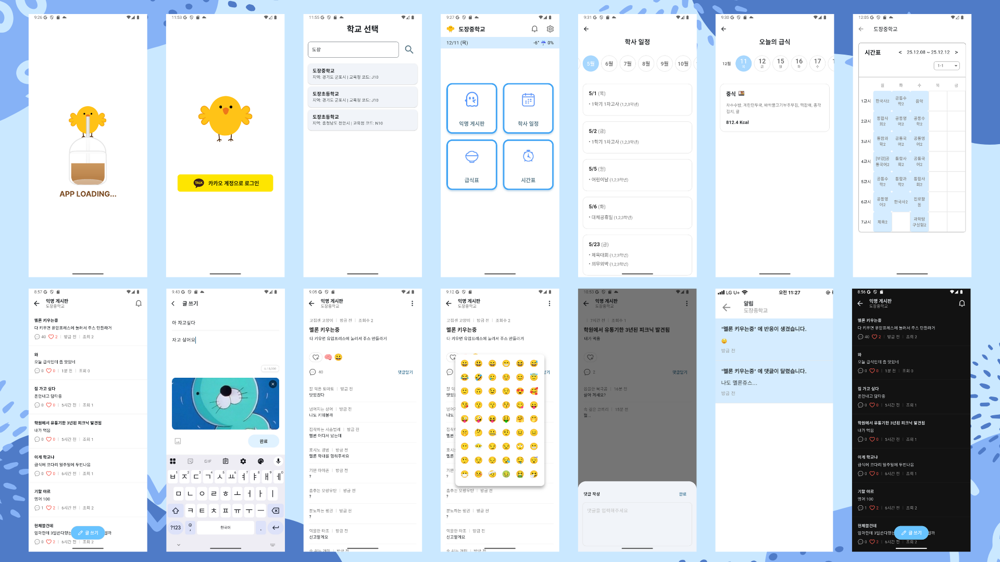

<h1 align="center">
Damso Time
</h1>

  

 

## 🔖 프로젝트 개요
### “Damso Time(담타)" 는 중고등학생을 위한 익명 SNS 커뮤니티 앱 입니다.

#### "Damso Time(담타)" 는 다음과 같은 분들을 위해 탄생되었습니다.

> 학교를 지정하여 자신과 같은 학교 친구들과 자유롭게 소통하고 싶은 분
> 

> 학교 생활과 관련된 정보를 편리하게 확인하고 싶은 분
> 

> 익명 게시글, 댓글, 반응을 통해 즐거운 소통을 원하시는 분
> 

      

## 🎨 앱 디자인 설계

  

 

## 📌 주요 기능
1. 학교 지정 및 정보 제공
- 사용자가 다니는 학교 선택
- 시간표 확인: 지정한 날짜와 반의 수업 시간표 확인
- 학사일정 확인: 월별 시험, 공휴일 등 주요 일정 조회
- 급식정보 확인: 지정한 날의 급식 메뉴 확인

2. 익명 SNS 커뮤니티
- 게시글 작성 및 댓글 작성
- 익명으로 소통하여 학생들의 자유로운 의견 공유 가능
- 다양한 이모지로 게시글에 반응을 남기는 기능

3. 사용자 편의 기능
- 간편한 로그인 및 회원가입
- 알림 기능으로 내 게시글의 댓글, 반응 손쉽게 확인 

 

## 🛠️ 기술 스택

| 구분 | 사용 기술 |
|---|---|
| **Framework** | Flutter (Cross-platform) |
| **Language** | Dart |
| **UI System** | Material, Cupertino |
| **Routing** | GoRouter (선언적 라우팅) |
| **State Management** | Riverpod 3.x (Provider / Notifier / AsyncValue) |
| **Architecture** | Clean Architecture (Domain 중심, 의존성 역전) |
| **Backend Platform** | Firebase |
| **Database (Remote)** | Cloud Firestore (NoSQL) |
| **Database (Local)** | Sqflite |
| **Authentication** | Firebase Auth, Kakao Login |
| **Push Notification** | Firebase Cloud Messaging (FCM) |
| **Serverless** | Firebase Cloud Functions |
| **Local Notification** | flutter_local_notifications |
| **Storage** | Firebase Storage |
| **HTTP Client** | Dio |
| **Location** | Geolocator |
| **Date / Time** | Intl |
| **Animation** | Lottie |
| **Image / Asset** | Image Picker, SVG |
| **UX / UI Effect** | Shimmer |
| **Badge Handling** | flutter_app_badger |
| **Icons** | Cupertino Icons, HugeIcons |

 

## 📖 라이브러리

### Firebase / Backend
- firebase_core: ^4.2.1  
- cloud_firestore: ^6.1.0  
- firebase_auth: ^6.1.2  
- firebase_messaging: ^16.0.4  
- cloud_functions: ^6.0.4  
- firebase_storage: ^13.0.4  
- flutter_local_notifications: ^19.5.0  

> 실시간 데이터 동기화, 인증, 푸시 알림, 배지 관리 및  
> Cloud Functions 기반 서버 로직 처리

### State Management / Architecture
- flutter_riverpod: ^3.0.3  
- hooks_riverpod: ^3.0.3  
- riverpod_annotation: ^3.0.3  
- flutter_hooks: ^0.21.3+1  
- freezed_annotation: ^3.1.0  
- json_annotation: ^4.9.0  

> Notifier 기반 상태 관리, 불변 객체(Entity / DTO),  
> 테스트 및 의존성 주입에 최적화된 구조

### Code Generation / Dev Tools
- build_runner: ^2.7.1  
- freezed: ^3.2.3  
- json_serializable: ^6.11.2  
- riverpod_generator: ^3.0.3  

> Entity / DTO 자동 생성, Riverpod Provider 코드 자동화

### Routing / UI / UX
- go_router: ^17.0.0  
- cupertino_icons: ^1.0.8  
- shimmer: ^3.0.0  
- lottie: ^3.3.2  
- flutter_svg: ^2.2.3  
- hugeicons: ^1.1.2  

> 선언적 라우팅, 로딩 UX 개선, 애니메이션 및 아이콘 활용

### Network / Utility
- dio: ^5.9.0  
- geolocator: ^14.0.2  
- intl: ^0.20.2  
- path: ^1.9.1  

> REST API 통신, 위치 기반 기능, 날짜·시간·지역화 처리

### Local / Media
- sqflite: ^2.4.2  
- image_picker: ^1.2.1  

> 로컬 데이터 캐싱 및 이미지 업로드 처리

### Social Login
- kakao_flutter_sdk_user: ^1.10.0  

> 카카오 계정 기반 로그인 및 사용자 연동

### App Configuration
- flutter_launcher_icons: ^0.14.4  
- flutter_native_splash: ^2.4.7  
- flutter_app_badger: ^1.5.0  

> 앱 아이콘, 스플래시 화면 설정 및 iOS 배지 관리

### Dev Dependencies
- flutter_test  
- flutter_lints: ^5.0.0  

 

## 📂 프로젝트 구조
<pre>
lib/                      
 ㄴ core/
     ㄴ config/   
     ㄴ di/               
     ㄴ services/               
     ㄴ theme/ 
     ㄴ util/                             
 ㄴ data/
     ㄴ data_source/      
         ㄴ local/
         ㄴ remote/                 
     ㄴ data_source_impl/  
         ㄴ local/
         ㄴ remote/   
     ㄴ database/         
     ㄴ dto/           
         ㄴ local_cache_dto/               
     ㄴ mapper/                        
     ㄴ repository_impl/   
     ㄴ util/     
         ㄴ extension/       
 ㄴ domain/
     ㄴ entity/   
     ㄴ enum/                    
     ㄴ repository/                   
     ㄴ usecase/                        
 ㄴ presentation/
     ㄴ core/util/                      
     ㄴ view/                          
         ㄴ pages/
             ㄴ home/   
             ㄴ login/            
             ㄴ meal/               
             ㄴ notification/           
             ㄴ post/
             ㄴ post_detail/
             ㄴ post_editor
             ㄴ schedule/
             ㄴ school/
             ㄴ splash/
             ㄴ time_table/
         ㄴ widgets/ 
     ㄴ view_model/    
 ㄴ main         
test/      
assets/     
README.md  
</pre>

 

## 📝 커밋 컨벤션

- feat: 새로운 기능 추가
- fix: 버그 수정
- docs: 문서 수정
- style: 코드 포맷팅, 세미콜론 누락 등
- refactor: 코드 리팩터링
- design: 사용자 UI 디자인 변경
- test: 테스트 코드 추가
- chore: 빌드, 패키지 매니저 등 환경 설정
